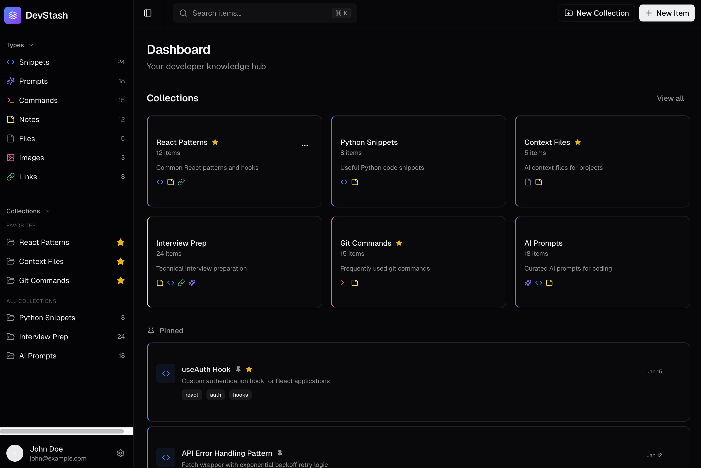
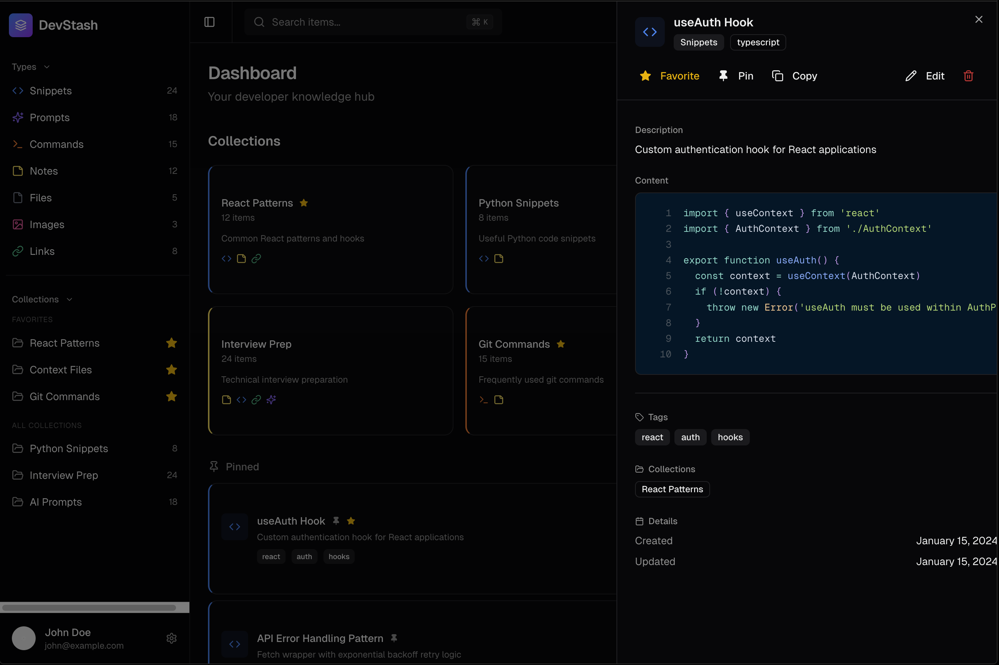

# DevStash

A developer knowledge hub for snippets, commands, prompts, notes, files, images, links and custom types.

**Live Demo:** https://devstash.giorgiana.li



## Features

- **7 item types** — Snippets, Prompts, Commands, Notes, Files, Images, URLs
- **Collections** — group any mix of items into named collections
- **Full-text search** — command palette (`Cmd+K`) across all content
- **Monaco code editor** — syntax highlighting, customizable preferences
- **Markdown editor** — write/preview with GFM support
- **File & image uploads** — drag-and-drop with Cloudflare R2 storage
- **Favorites, pins, tags** — organize and surface what matters
- **AI features (Pro)** — auto-tagging, descriptions, code explanations, prompt optimization
- **Stripe billing** — free tier (50 items, 3 collections) and Pro plan



## Tech Stack

| Category | Choice |
|----------|--------|
| Framework | Next.js 15 (App Router, React 19) |
| Language | TypeScript (strict) |
| Database | Neon PostgreSQL + Prisma ORM |
| Auth | NextAuth v5 (email/password + GitHub OAuth) |
| Storage | Cloudflare R2 |
| UI | Tailwind CSS v4 + shadcn/ui |
| AI | OpenAI API |
| Payments | Stripe |
| Testing | Vitest |

## Getting Started

```bash
# Install dependencies
npm install

# Set up environment variables
cp .env.example .env

# Run database migrations
npm run db:migrate

# Seed demo data
npm run db:seed

# Start dev server
npm run dev
```

Open [http://localhost:3000](http://localhost:3000).

## Scripts

```bash
npm run dev            # Start dev server
npm run build          # Production build
npm run lint           # ESLint
npm run test:run       # Run tests
npm run test:coverage  # Tests with coverage
npm run db:migrate     # Run Prisma migrations
npm run db:seed        # Seed demo data
npm run db:studio      # Open Prisma Studio
```

## License

MIT
